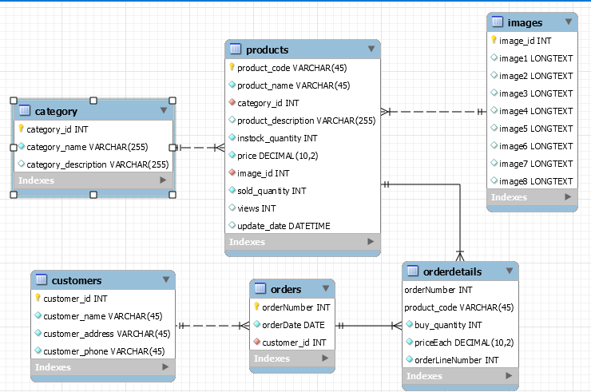

# caseStudy2

Đề tài: website bán hàng 

1. Giao diện của nhà quản lý: đủ các chức năng CRUD
2. Giao diện phía người dùng:
	- Trang chủ: 
		+Header: 
			.Thanh navi:Logo ,Home, categories, Contact, ..., search
			.Slider các sản phẩm nổi bật
		+ Main content:
			.Các sản phẩm mới nhất(Ảnh, tên, giá)
			.Các sản phẩm best seller
		+ Footer:
			.Form đăng kí thông tin
			.Footer(thông tin cửa hàng, copyright, ...) 
	- Trang categories(phân theo từng thể loại)
		+ Header: 
			.Thanh navi
		+ Main content:
			.Tất cả các sản phẩm của cửa hàng
		+ Footer:
			.Form đăng kí thông tin
			.Footer(thông tin cửa hàng, copyright, ...) 
	- Trang sản phẩm chi tiết:
		+ Header: 
			.Thanh navi
		+ main content:
			.Bên trái: 1 dãy tầm 3, 4 ảnh nhỏ của sản phẩm được chụp theo nhiều góc khác nhau
			.Ở giữa: Ảnh lớn của các ảnh bên trái
			.Bên phải: Thông tin chi tiết của sản phẩm (tên, giá, description), 1 button add to cart
		+ Footer:
			.Form đăng kí thông tin
			.Footer(thông tin cửa hàng, copyright, ...)
	- Trang Cart & checkout:
		+ Header: 
			.Thanh navi
		+ Main content:
			.Chia ra 2 nửa, 1 bên để điền thông tin của khách hàng, 1 bên hiện lên thông tin chi tiết giỏ hàng
		 + Footer:
			.Form đăng kí thông tin
			.Footer(thông tin cửa hàng, copyright, ...)		
		
		
		
	
	
